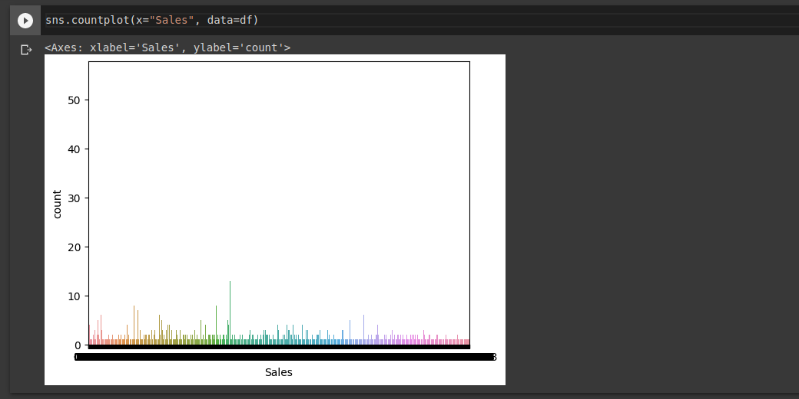

# Ex03-Univariate-Analysis
# AIM:
To read the given data and perform the univariate analysis with different types of plots.
# THEORY:
Univariate analysis is basically the simplest form to analyze data. Uni means one and this
means that the data has only one kind of variable. The major reason for univariate analysis
is to use the data to describe. The analysis will take data, summarise it, and then find some
pattern in the data.
# ALGORITHM:
### Step 1:
Read the given data.
### Step 2:
Get the information about the data.
### Step 3:
Remove the null values from the data.
### Step 4:
Mention the datatypes from the data.
### Step 5:
Count the values from the data.
### Step 6:
Do plots like boxplots,countplot,distribution plot,histogram plot.
# PROGRAM:
## FOR DATA 1:
```
#Developed by : Akshayaa M
#Registration Number : 212222230009
import pandas as pd
df=pd.read_csv("SuperStore.csv")
df
df.head()
df.info()
df.describe()
df.isnull().sum()
df.dtypes
df['Sales'].value_counts()
sns.boxplot(x='Sales', data=df)
sns.countplot(x='Sales',data=df)
sns.distplot(df["Sales"])
sns.histplot(x='Sales',data=df)
```
## FOR DATA 2:
```
#Developed by : Akshayaa M
#Registration Number : 212222230009
import pandas as pd
df=pd.read_csv("diabetes.csv")
df
df.head()
df.info()
df.describe()
df.isnull().sum()
df.dtypes
df['BMI'].value_counts()
sns.boxplot(x='BMI', data=df)
sns.countplot(x='BMI',data=df)
sns.distplot(df["BMI"])
sns.histplot(x='BMI',data=df)
```
# OUTPUT:
## FOR DATA 1:





## DATA 2:


# RESULT:
Thus we have read the given data and performed the univariate analysis with different types of plots.